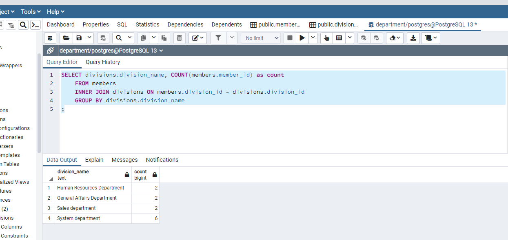

# diveintocode-rdbms-exam

Note : add headers in members_en.csv and divisions_en.csv


## 1. init db
```sql
CREATE DATABASE department; # createdb department

CREATE TABLE divisions (division_id integer, division_name text);

CREATE TABLE members (member_id integer, name text, division_id integer);
```

## 2. populate
```sql
\copy public.divisions (division_id, division_name) FROM 'D:/DIC/sql/department-master/divisions_en.csv' DELIMITER ',' CSV HEADER

\copy public.members (member_id, name, division_id) FROM 'D:/DIC/sql/department-master/members_en.csv' DELIMITER ',' CSV HEADER
```

## 3. query

```sql
--- final exam query
SELECT divisions.division_name, COUNT(members.member_id) as count
	FROM members
	INNER JOIN divisions ON members.division_id = divisions.division_id
	GROUP BY divisions.division_name
;
```



